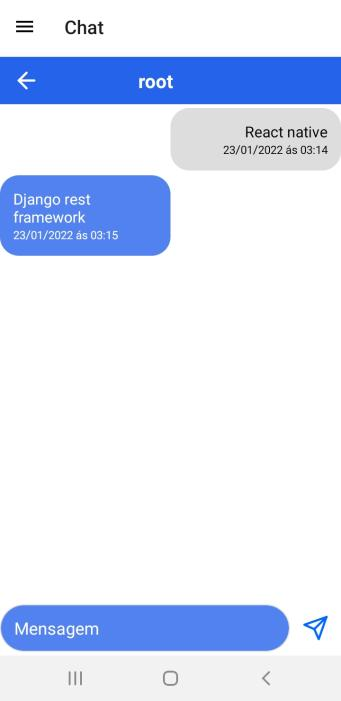

# Chat

## Sobre

App de conversa, com sistema de amizade.

### `Instalação (Dev) && Inicialização`

1. yarn (recomendado) | npm i
2. expo start

### `Backend`

[Backend está aqui](https://github.com/MrPowerUp82/chat_web)

## Exemplo

